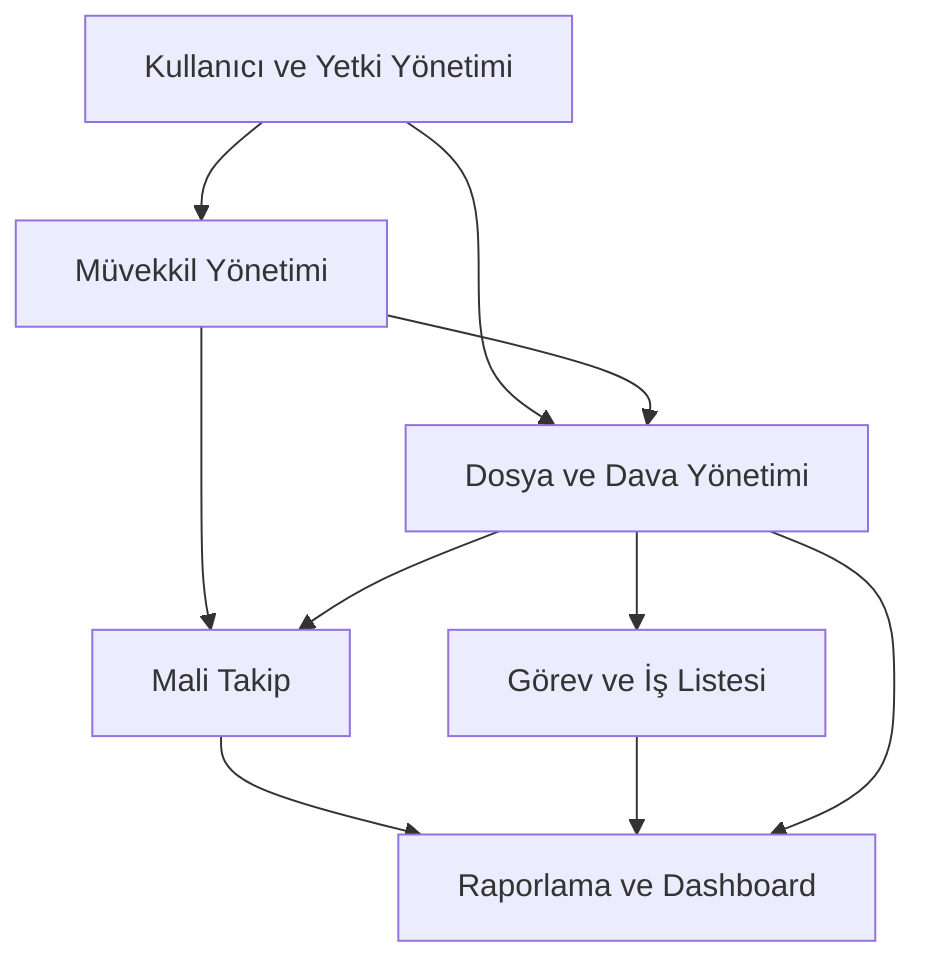

# Proje Yol Haritası ve Modül İlişkileri

Bu doküman, sistemin modüller arası veri akışını ve hangi sırayla geliştirileceğini tanımlar.

## 1. Modül İlişkileri ve Bağımlılık Grafiği

Sistem, "Kullanıcı ve Yetki" modülü üzerine inşa edilir. Diğer tüm işlemler bu temel üzerine oturur.

## 2. Geliştirme Sırası (Roadmap)

Geliştirme süreci, birbirini besleyen veriler doğrultusunda şu sırayla ilerleyecektir:

### Aşama 1: Temel Altyapı ve Auth (Hafta 1)
- **Neden:** Diğer tüm modüller kullanıcı yetkisine ihtiyaç duyar.
- **Kapsam:** Login, Rol tanımlama, Yetki kontrolü (Guard'lar).

### Aşama 2: Müvekkil Yönetimi (Hafta 2)
- **Neden:** Dosya açmak için sistemde bir müvekkil olmalıdır.
- **Kapsam:** Gerçek/tüzel kişi kayıtları, iletişim geçmişi.

### Aşama 3: Dosya ve Dava Yönetimi (Hafta 3-4)
- **Neden:** Uygulamanın ana fonksiyonudur.
- **Kapsam:** Dosya açma, mahkeme bilgileri, duruşma takvimi, belge yükleme.

### Aşama 4: Mali Takip (Hafta 5)
- **Neden:** Dosyalara bağlı vekalet ücretleri ve masraflar bu aşamada yönetilir.
- **Kapsam:** Alacak kaydı, tahsilat, gider yönetimi, bakiye hesabı.

### Aşama 5: Görev Yönetimi ve Hatırlatıcılar (Hafta 6)
- **Kapsam:** Dosya bazlı görevler, süre takipleri, bildirimler.

### Aşama 6: Raporlama ve Dashboard (Hafta 7)
- **Kapsam:** Özet raporlar, mali tablolar, performans dashboard'u.

---

## 3. Veri Akış Kuralları
1. **Silme Yerine Arşivleme:** Hiçbir veri fiziksel olarak silinmez (`is_deleted` flag).
2. **Bağlılık:** Bir dosya silindiğinde/arşivlendiğinde ona bağlı görevler ve mali kayıtlar korunur ama pasifleşir.
3. **Mali Tutarlılık:** Tahsilat silindiğinde bağlı olduğu alacak/bakiye otomatik yeniden hesaplanır.
